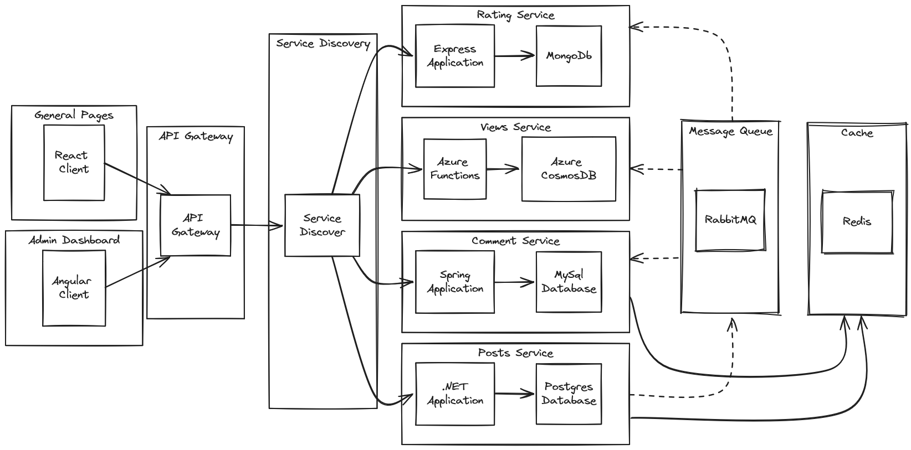

# 🛠️ Microservices: Content Management System 🛠️  

This is an optimistic attempt to implement a **Content Management System** in a truly **Microservices** Architecture inside a **Kubernetes** cluster . 

Each service is planned to be implemented using a different technology.  

- **A bit onthe Architeture:**


- **A bit deeper Architecture:** 


- **Kubernetes Architecture:**


## Back-End
This is where the **Microservices** Shine. 
Details about each Service will be inside their respective folder.  
- **Posts Service**: A .NET Web API application, this is the core component. 
	- Responsible for managing the Posts, Caching to **Redis** and publishing events to **RabbitMQ** for other services on updates on posts: 
		- Post Added Event
		- Post Deleted Event
		- Post Cached Event
		- Post Requested Event
	- Managing a **Scheduled Background Service** responsible for Caching highly rated and most viewed posts. 
- **Comments Service:** A Spring Web API application. 
	- Responsible for managing comments, It will also subscribe to some of the posts events. 
- **Ratings Service:** A NodeJS/Express Web API application. 
	- Responsible for managing votes and ratings of posts and comments, It will also subscribe to some of the posts events. 
- **Views Service:** A NodeJS/Express Web API application. 
	- Responsible for managing posts' views, It will also subscribe to some of the posts events. 
- **Authentication Service**: A .NET Authentication Server responsible for handling **Users**, **Authentication** and **Authorization**.

## Front-End 

Front-End is divided into 2 parts so far
- **General Pages:** where users/guests browse the posts, this will be a **React** Application
- **Admin Pages:** where users/admin, this will be an **Angular** Application 
- A **React Native** Crossplatform application will be added eventually. 

**Front-End** will communicate with the **Back-End** through an **API Gateway**

## API Gateway
This in an **NGINX Ingress Controller** for **Kubernetes**.

---

## Get it running 
### Docker Containers
```bin
docker run --name postsdb -d -p 5400:5432 -e POSTGRES_PASSWORD=mysecretpassword postgres
docker run --name redis -d -p 6300:6379 redis:alpine
docker run --name rabbit -d -p 5600:5672 -p 5700:15672  masstransit/rabbitmq

docker run --name commentsdb -d -p 3300:3306 -e MYSQL_ROOT_PASSWORD=P4ssword! -e MYSQL_USER=newuser -e MYSQL_PASSWORD=P4ssword! -e MYSQL_DATABASE=CommentsService mysql

docker run --name ratingsdb -d -p 27000:27017 -e MONGO_INITDB_ROOT_USERNAME=mongoadmin -e MONGO_INITDB_ROOT_PASSWORD=mysecretpassword -e MONGO_INITDB_DATABASE=StructorCMS mongo
```
### Kubernetes
```bin
kubectl apply -f redis-depl.yaml
kubectl apply -f rabbit-depl.yaml
kubectl apply -f comments-db-depl.yaml
kubectl apply -f posts-db-depl.yaml

kubectl apply -f posts-depl.yaml
kubectl apply -f comments-depl.yaml
kubectl apply -f ratings-depl.yaml
```